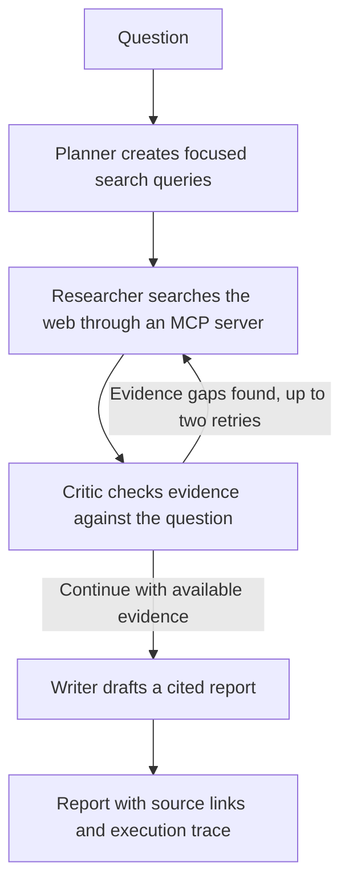

# Research Agent

A research assistant for questions that require current web information, more than one fact, or a clear trail back to sources. It searches the web, checks whether the retrieved material addresses the question, and drafts an answer with links to the sources it used.

The project is designed to make research easier to review, not to replace expert judgment. It is built with LangGraph, a web-search MCP server, and a Streamlit interface. The currently implemented language-model providers are Ollama and Groq.

---

## The problem it addresses

Language models can produce fluent answers without showing where the information came from. This is especially limiting when the question concerns recent events, combines several facts, or needs to be checked by another person. Searching manually can be slow, and a single model response may not distinguish supported facts from assumptions.

This agent combines web search with an explicit research workflow. It is most useful when a person needs a sourced first draft or a compact starting point for further investigation.

---

## How it works



| Stage | Role |
|---|---|
| Planner | Breaks a question into focused search queries. |
| Researcher | Uses a separate MCP server process to search the web and collect result titles, URLs, and snippets. |
| Critic | Assesses whether the collected sources address the requested facts and identifies gaps for follow-up searches. |
| Writer | Produces a report that attaches source identifiers to factual claims; the interface links those identifiers to retrieved URLs. |

The Critic can send the workflow back for up to two additional searches. The system uses search-result snippets rather than independently reading and validating every full web page. Its checks and citations improve traceability, but they do not guarantee that every claim is correct. Review the cited sources for important decisions.

## Model providers

Ollama and Groq are implemented in the current code. Select one with `LLM_PROVIDER` in `.env`. Ollama runs a model through a local Ollama service; Groq sends requests to its hosted API and requires a Groq API key. The app also uses a local Hugging Face sentence-transformer for evaluation embeddings. That embedding model is not a configured chat-model provider.

Gemini, OpenAI, Anthropic Claude, and Hugging Face-hosted chat models are not currently enabled. The provider interface in `src/config.py` gives the project a place to add them, but each provider needs its LangChain integration, configuration and credentials, and verification that its model supports the structured output and asynchronous calls used by the Planner and Critic. An API key alone will not make an unimplemented provider work.

Using a hosted model does not remove the purpose of the agent. The provider supplies language-model inference; the application supplies the research workflow: search-tool access, query planning, evidence collection, gap-driven retries, and source-linked output. Provider choice affects cost, latency, privacy, availability, and model behavior, but it does not replace those application-level steps. The agent is not automatically more accurate than a model used directly; its value is a repeatable process that makes sources and evidence gaps easier to inspect.

## When to use it

This tool is a good fit when you need to:

- Gather current public-web information before drafting a briefing, overview, or research note.
- Explore a question whose answer depends on several related facts.
- Give colleagues a response they can check through source links.
- Compare an agent workflow against a single-model baseline using the included benchmark.

It is less suitable when the answer must come from private documents or a controlled database, when the task requires a guaranteed exhaustive search, or when an expert-approved answer is required without human review. The current search tool queries the public web, and the Critic checks returned snippets; it does not authenticate sources, crawl every page, or provide a compliance guarantee. For high-impact decisions, use the report as a research aid and verify the original sources.

## Setup

### Requirements

- Python 3.10 or newer.
- Git, if cloning the repository.
- One configured language-model option: an installed and running Ollama service with a downloaded model, or a Groq API key.
- An internet connection for web search and package installation.

### Get the project

On the project's repository page, select **Code**, copy the HTTPS clone URL, and replace `<repository-url>` below:

```bash
git clone <repository-url>
cd agentic-research-mcp-v2
```

Alternatively, download and extract the project archive, then open a terminal in the extracted project folder.

### Install dependencies

Create and activate a virtual environment from the project folder:

```bash
python -m venv .venv
```

Windows PowerShell:

```powershell
.venv\Scripts\Activate.ps1
```

macOS or Linux:

```bash
source .venv/bin/activate
```

Install the project packages:

```bash
python -m pip install --upgrade pip
python -m pip install -r requirements.txt
```

### Choose a language model

Create `.env` from the provided example, then edit the values for one provider:

```bash
cp .env.example .env
```

In Windows PowerShell, `Copy-Item .env.example .env` performs the same step. Do not share or commit `.env`; it may contain credentials.

For Groq, set `LLM_PROVIDER=groq`, add your key to `GROQ_API_KEY`, and set `GROQ_MODEL` to a model available to your Groq account. Create or manage keys at [Groq Console](https://console.groq.com/).

For Ollama, install and start Ollama, download a model supported by your Ollama installation, and set `LLM_PROVIDER=ollama` and `OLLAMA_MODEL` to that model's name. The default is `qwen2.5:1.5b`; you can replace it with another model available to Ollama. If Ollama is running somewhere other than the default local address, set `OLLAMA_BASE_URL` accordingly.

The LangSmith variables in `.env.example` are optional tracing settings. Leave tracing disabled or remove those entries if you do not use LangSmith; do not add a LangSmith key unless you have one and intend to send traces to that service.

This repository provides a self-hosted application, not a hosted public service. Once installed and configured, the Streamlit interface can be used without writing code. To make it available to non-technical users without local setup, an administrator must deploy and maintain the application and securely configure its model-provider credentials. Do not ask users to enter provider keys into a shared deployment.

## Run the agent

Start the Streamlit interface:

```bash
python -m streamlit run app.py
```

Open the local URL printed in the terminal, enter a research question, and select **Run Research Pipeline**. The results page shows the report, source links, and an execution trace. For a first check, ask a question about a recent public event and open the cited sources to compare them with the answer.

The project also exposes an optional FastAPI endpoint:

```bash
python main.py
```

Once it starts, submit a JSON request to `http://127.0.0.1:8000/api/research`, for example:

```bash
curl -X POST http://127.0.0.1:8000/api/research \
    -H "Content-Type: application/json" \
    -d '{"query":"What are the latest public updates on the topic?"}'
```

## Evaluate the workflow

The `eval/` directory contains a 15-question benchmark with answerable, recent, multi-part, and open-ended prompts. After configuring a provider and installing the dependencies, run:

```bash
python -m eval.run_eval
python -m eval.run_baseline
python -m eval.compare_results
```

The first command runs the agent and scores its outputs with RAGAS. The second runs the same benchmark as single model calls. The third creates `eval/comparison.md` and, when Matplotlib is available, `eval/comparison.png`.

The evaluation requires model calls, web access, and local embedding-model downloads. Results depend on the selected model, search results, and changing benchmark facts. Treat scores as measurements for this benchmark and configuration, not as a guarantee of performance on other questions. See [eval/README.md](eval/README.md) for details.

## Project structure

```text
app.py                      Streamlit user interface
main.py                     FastAPI research endpoint
mcp_server/
    search_server.py          MCP server for public web search
src/
    config.py                 Language-model and embedding configuration
    agents/
        graph.py                Planner, Researcher, Critic, and Writer workflow
        state.py                Data structures shared by workflow stages
    tools/
        mcp_client.py           MCP client for the search server

    benchmark.json            Evaluation questions and reference answers
    run_eval.py               Agent workflow evaluation
    run_baseline.py           Single-model comparison evaluation
    compare_results.py        Comparison table and chart generation
```

## Technology

LangGraph, LangChain, FastMCP, `langchain-mcp-adapters`, Ollama, Groq, DuckDuckGo Search, Streamlit, FastAPI, RAGAS, and Hugging Face sentence-transformers for local evaluation embeddings.

## Planned extensions

- Add integrations for additional chat-model providers, subject to structured-output support.
- Add HTTP-based MCP transport for separately hosted search services.
- Expand the interface to show evidence at the claim level.
- Add MCP tools for private document collections and other research sources.
