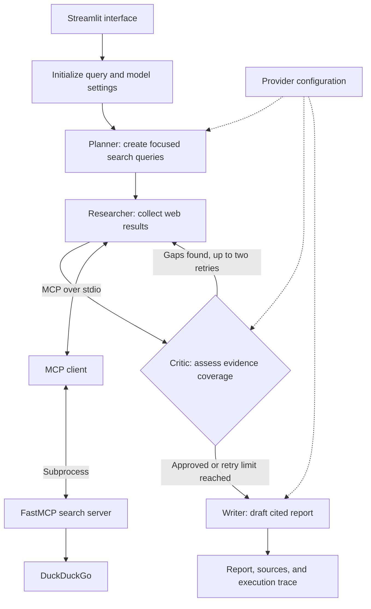

# DevAgent: Autonomous Multi-Provider Research Fleet

DevAgent is an evidence-first research assistant built with LangGraph, the Model Context Protocol (MCP), and Streamlit. It plans focused searches, retrieves current web results, checks whether the collected evidence covers the question, and produces a cited report with traceable sources.

The workflow makes research easier to review; it does not guarantee that every claim is correct. Search results are based on retrieved web snippets, so verify original sources before relying on the report for important decisions.

## Architecture

The application separates the agent workflow from the web-search process. Provider credentials are resolved at runtime and are not included in the LangGraph state.



## Agent workflow

| Stage | Responsibility |
|---|---|
| Planner | Decomposes the question into focused, entity-specific search queries. |
| Researcher | Calls the MCP search tool and collects result titles, URLs, and snippets with source identifiers such as `[S1]`. |
| Critic | Checks whether the collected evidence addresses the question and requests follow-up searches when it finds gaps. |
| Writer | Produces a source-grounded report with links from citations to retrieved sources. |

The Critic can send the workflow back for up to two additional searches. It evaluates the retrieved snippets; it does not independently validate every full web page or guarantee exhaustive coverage.

## Credential handling

API keys entered for a run are kept outside the graph state. `src/config.py` uses a task-local
`contextvars` value to resolve a session key when the model client is created. This keeps the key
out of the state object that LangGraph records and serializes. Environment-based provider keys
can also be configured for local or hosted deployments; protect those secrets and restrict access
to any deployment that uses them.

## Model providers

The model factory supports Groq, xAI, Google Gemini, OpenAI, Anthropic, Hugging Face endpoints,
and Ollama. Hosted providers require their corresponding API key; Ollama requires a local Ollama
service and an available model. Provider integrations and model capabilities can differ, so choose
a model compatible with the structured outputs and asynchronous calls used by the Planner and
Critic.

The project also uses a local Hugging Face sentence-transformer for evaluation embeddings. This is separate from the configured chat-model provider.

## Setup

### Requirements

- Python 3.10 or newer.
- An internet connection for package installation and web search.
- Credentials for a supported hosted model, or an installed and running Ollama service.

### Install

Clone the repository and enter its directory:

```bash
git clone https://github.com/Nikhil-707/evidence-first-research-agent.git
cd evidence-first-research-agent
```

Create and activate a virtual environment:

```powershell
python -m venv .venv
.venv\Scripts\Activate.ps1
```

On macOS or Linux, activate it with:

```bash
source .venv/bin/activate
```

Install dependencies:

```bash
python -m pip install --upgrade pip
python -m pip install -r requirements.txt
```

### Configure a provider

Create a local `.env` file in the project root and set the variables for your provider. For example:

```dotenv
LLM_PROVIDER=groq
GROQ_API_KEY=your_groq_api_key
GROQ_MODEL=openai/gpt-oss-120b
```

Use the matching settings for other providers, such as `OPENAI_API_KEY` and `OPENAI_MODEL`, `GOOGLE_API_KEY` and `GEMINI_MODEL`, or `OLLAMA_MODEL` and `OLLAMA_BASE_URL`. Do not commit `.env` or share provider credentials. The Streamlit interface can also accept a session key for a research run.

## Run the application

Start the Streamlit interface:

```bash
python -m streamlit run app.py
```

Open the local URL printed in the terminal, enter a research question, and run the pipeline. The results include the report, source links, retrieved snippets, and execution trace.

## Optional REST API

Start the FastAPI service:

```bash
python main.py
```

Submit a research request to `http://127.0.0.1:8000/api/research`:

```bash
curl -X POST http://127.0.0.1:8000/api/research \
  -H "Content-Type: application/json" \
  -d '{
    "query": "What are the latest public updates on the topic?",
    "provider": "groq",
    "model": "openai/gpt-oss-120b"
  }'
```

## Deploy with Streamlit Community Cloud

1. Push the repository to GitHub and create an app at [share.streamlit.io](https://share.streamlit.io/).
2. Select the repository and branch, and set `app.py` as the entry point.
3. Add required provider settings in the app's Secrets configuration, using the same variable names as in `.env`.
4. Deploy the app and restrict access appropriately. A provider key configured as an app secret is used by the deployment and may incur usage costs; do not expose a shared deployment with unrestricted access to that credential.

## Evaluate the workflow

The `eval/` directory contains a benchmark harness that compares the research pipeline with a single-call model baseline using RAGAS Faithfulness and Answer Correctness metrics:

```bash
# Run the agent workflow over the benchmark
python -m eval.run_eval

# Run the single-call baseline
python -m eval.run_baseline

# Generate the comparison summary and chart
python -m eval.compare_results
```

Evaluation results and comparison artifacts are written to `eval/`. The comparison chart requires Matplotlib.

## Repository structure

```text
.
├── app.py                  # Streamlit frontend
├── main.py                 # FastAPI REST endpoint
├── mcp_server/
│   └── search_server.py    # FastMCP web-search server
├── src/
│   ├── config.py           # Model factory and credential handling
│   ├── agents/
│   │   ├── graph.py        # Planner, Researcher, Critic, and Writer graph
│   │   └── state.py        # Agent state definition
│   └── tools/
│       └── mcp_client.py   # MCP subprocess client
├── eval/
│   ├── benchmark.json      # Research benchmark questions
│   ├── run_eval.py         # Pipeline evaluation
│   ├── run_baseline.py     # Single-call baseline evaluation
│   └── compare_results.py  # Comparison report and chart generation
└── requirements.txt        # Python dependencies
```

## License

This project is licensed under the MIT License.